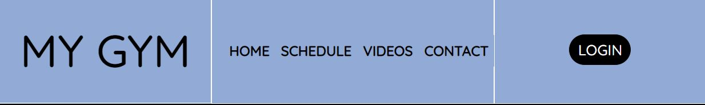
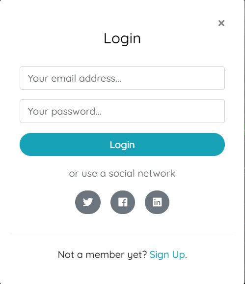
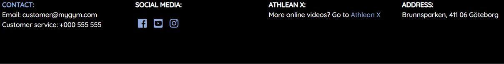

# MyGym

## Welcome to my page [MyGym](https://charlie9009.github.io/CI_MS1_MYGYM/)!
 
MyGym is a site that wants to increase peoples well being and motivate others by offering personal trainers and online videos. Due to Covid, MyGym wants to help people who now struggle with working out. Either by not working out at all, or alone in the wrong way not getting the help needed. By using MyGym they will be able to work out from home in a safe and effective way.  
The site is targeted towards everyone that wants to increase their health and/or wants help to get started with their training. The site is also for people who wants to explore new ways of working out by not being able to go to the gym. MyGym offers a wide variation of group training which can be booked from the site. What makes MyGym special is that we dont allow more than 10 people per personal trainer. This makes it possible for the trainer to tailor the best workout for every customer.  

## Features

* **Navigation bar, Footer section**

    * The navigation bar and the footer are featured on all four pages and they are responsive. The navigation bar shows links to the logo, Home, Schedule, Videos, Contact and a Login button. When on smaller screen sizes the login button will dissapear to allow for a clean and user friendly site. The login button is a pop up modal, so when you click it there will pop up a window in the middle of the screen.
    
    
    * The footer shows Contact info, Social media icons, Athlean X link and MyGyms location. When on smaller screen sizes the footer will only show a link to the contact page and social media icons to make the footer easily navigated.
    

### Home

* **Hero Section**

    * When you load the page the first thing the user will see is the big carousel with 3 images scrolling.
    * On the images there are headers with information depending on what the user might be after. There is a login button on every      image which is fully responsive. On one image, info for the schedule to book a workout and a link to that page, on the second image info to get in touch with a personal trainer and a link and on the third image info about Athlean X and a link to that page. When on a small screen the headers dissaper to keep the site clean.
    * There is also a header above the carousel to welcome the user.

* **Group Training section**

    * The group training section will give examples of what kind of group trainings are offered and tell the user our personal trainers are well educated.
    * This section has an image to encourage the user to work out together with a group.

* **Online Training section**

    * The online training section will encourage the user to check out Athlean X and go to MyGyms video page if they want to workout online, to keep it user friendly links are provided to both pages in the text.
    * This section also has an image from Athlean X to give the user a face to Athlean X.

### Schedule

* **Booking section**

    * Beneath the nav bar there is a heading to welcome the user to the page and to reasure them they are on the schedule page.
    * There is a form where the user can book their next training session.

* **Schedule section**

    * Beneath the form there is a big schedule where you can see the weeks training sessions, there is information about what workout, which day and time, as well as the personal trainer leading the session.

### Videos

* **Video section**

    * At the top of the page there is a heading encouraging the user for todays workout.
    * Beneath the heading there are a variate of workout videos with different muscelgroups depending on what the user want to work on today.

### Contact

* **Contact section**

    * At the top of the page there is a heading to reasure the user they are on the contact page.
    * Beneath the header to the left there is a container with contact information and a price tag for membership in MyGym.
    * To the right of contact information there is a container with a question form if a user would have any questions.
        * When on smaller devices these two container stacks on top of eachother.

* **Location**

    * At the bottom of the page there is a map of the Gyms location and above it text containing the address.

### Features left to implement

* **Personal trainers**

    * A section with information about all of the personal trainers.

* **Group training**

    * A section with information about every single group workout offered at the gym and a layout of how every session could look like.

Customer goals

I want to increase my well being.

I want to feel inspired to workout when navigating the web page.

I want to build muscles in a safe and effective way.

I want to relate to the brand.

I want to feel that I can trust the personal trainers from watching their videos.

I want to see and feel results by using the service.

I want to be able to easily find contact info and location of the gym.

I want to be able to find the schedule and book sessions.

Website Developer

I want the customer to trust the brand.

I want to offer the customer a good service.

I want the customer to feel happy using my service.

I want the customer to be able to easily book sessions.

I want the customer to tell their friends and family how much they enjoy my website.

I want the customer to feel it's worth signing up for the service.

code credit

modal
https://www.codehim.com/bootstrap/bootstrap-4-modal-popup-login-form/

carousel
https://getbootstrap.com/docs/4.0/components/carousel/

Timetable/Schedule
https://www.bootdey.com/snippets/view/time-table#html