# MyGym

## Welcome to my site [MyGym](https://charlie9009.github.io/CI_MS1_MYGYM/)!
 
MyGym is a site that wants to increase peoples wellbeing and motivate others by offering personal trainers and online videos. Due to Covid, MyGym wants to help people who now struggle with working out. Either by not working out at all, or alone in the wrong way not getting the help needed. By using MyGym they will be able to work out from home in a safe and effective way.  
The site is targeted towards everyone that wants to increase their health and/or wants help to get started with their training. The site is also for people who wants to explore new ways of working out by not being able to go to the gym. MyGym offers a wide variation of group training which can be booked from the site. What makes MyGym special is that we dont allow more than 10 people per personal trainer. This makes it possible for the trainer to tailor the best workout for every customer.
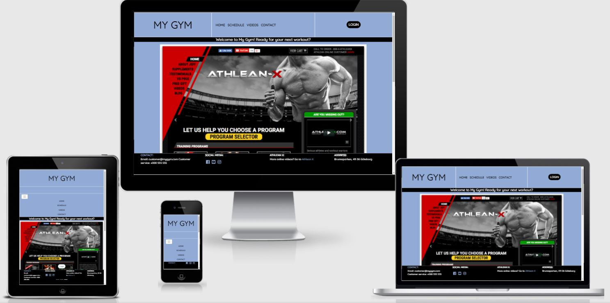

## Site owner goals

* As a site owner I want the customer to trust the brand.

* As a site owner I want to offer the customer a good service.

* As a site owner I want the customer to feel happy using my service.

* As a site owner I want the customer to be able to easily book sessions.

* As a site owner I want the customer to tell their friends and family how much they enjoy my MyGym.

* As a site owner I want the customer to feel it's worth signing up for the service.

## User stories

* I have not worked out in a while so I want to increase my wellbeing.

* When I work out I find myself having pain in my back from not training with proper form so I feel I need help.

* I am a single parent so I dont have a lot of time to work out during the day.

* I was at the gym the other day and I forgot my bag in a locker and I am wondering if it has been found. I also want to talk to my personal trainer.

* I have become bored of my usual group workout so I want to find a new class.

* I am a very busy person and I dont like looking a long time for information.

* My friend just told me about MyGym and how happy he was with the gym so I'm wondering what it costs.

* I like working out from home and I am very happy with the online workouts from Athlean X.

* I like to keep up with what is happening with MyGym and when new videos are released.

## Features

* **Navigation bar, Footer section**

    * The navigation bar and the footer are featured on all four pages and they are responsive. The navigation bar shows links to the Logo, Home, Schedule, Videos, Contact and a Login button. When on smaller screen sizes the login button will dissapear to allow for a clean and user friendly site. The login button is a pop up modal, so when you click it there will be a pop up window in the middle of the screen.
    * The footer shows Contact info, Social media icons, Athlean X link and MyGyms location. When on smaller screen sizes the footer will only show a link to the contact page and social media icons to make the footer easily navigated.
    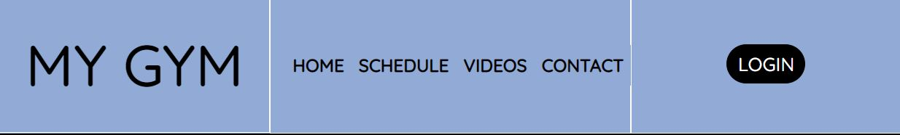
    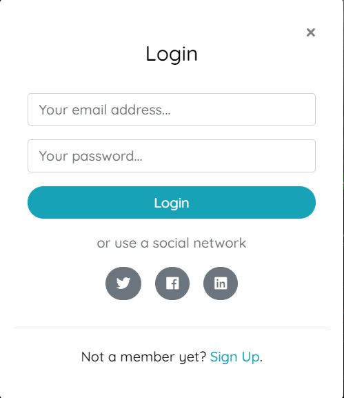
    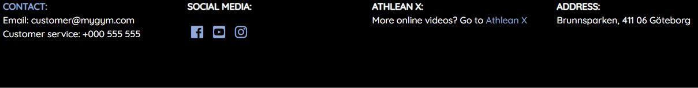

### Home

* **Hero Section**

    * When you land on the site the first thing the user will see is the big carousel with 3 images rotating.
    * On the images there are headers with information depending on what the user might be after. There is a login button on every image which is fully responsive. On the first image there's info about the membership cost, on the second image there's info to get in touch with a personal trainer and a link and on the third image there's info about Athlean X and a link to that page. When on a small screen the headers disappear to keep the site clean.
    * There is also a header above the carousel to welcome the user.
    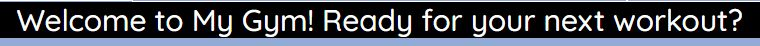
    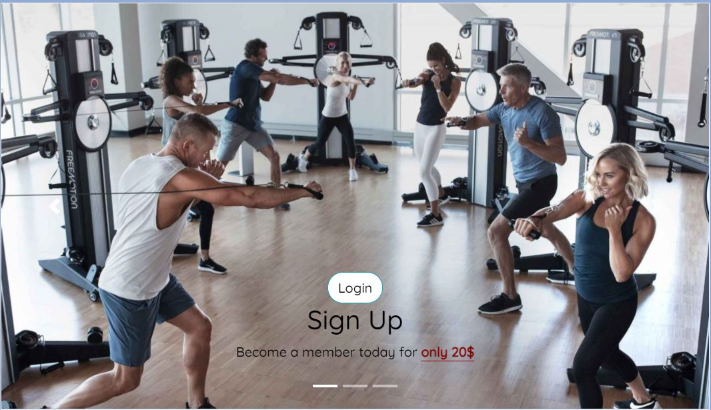
    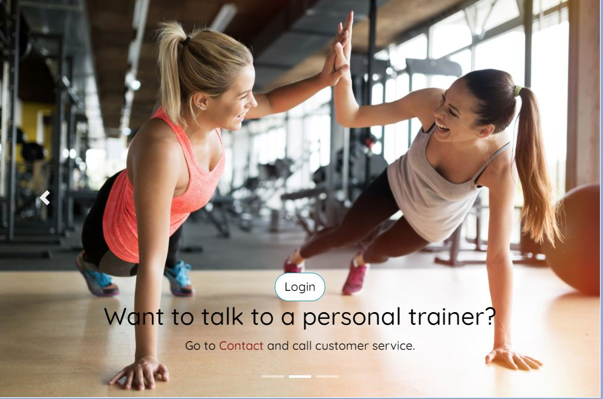
    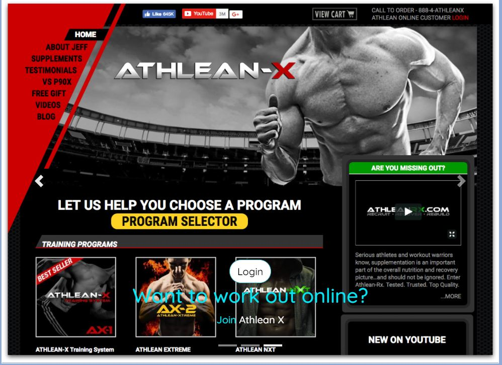

* **Group Training section**

    * The group training section will give examples of what kind of group trainings are offered and tell the user our personal trainers are well educated.
    * This section has an image to encourage the user to work out together with a group.
    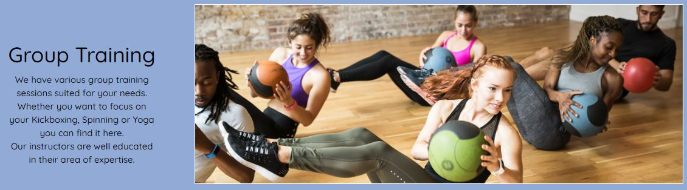

* **Online Training section**

    * The online training section will encourage the user to check out Athlean X and go to MyGyms video page if they want to workout online, to keep it user friendly links are provided to both pages in the text.
    * This section also has an image from Athlean X to give the user a face to Athlean X.
    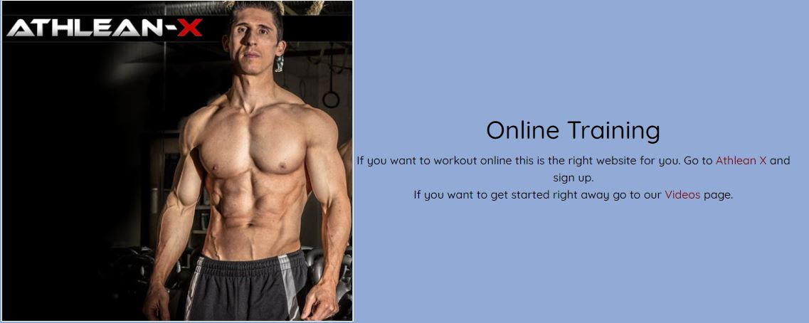

### Schedule

* **Booking section**

    * Beneath the nav bar there is a heading to welcome the user to the page and to reasure them they are on the schedule page.
    * There is a form where the user can book their next training session.

* **Schedule section**

    * Beneath the form there is a big schedule where you can see the weeks training sessions, there is information about what workout, which day and time, as well as the personal trainer leading the session.
    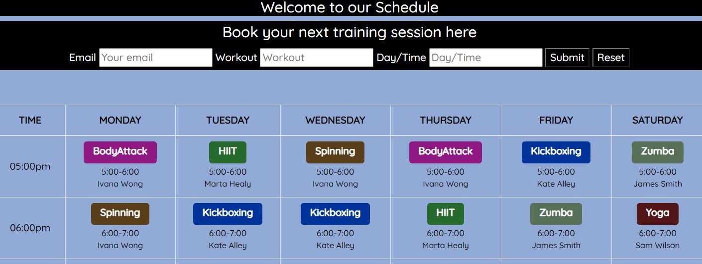

### Videos

* **Video section**

    * At the top of the page there is a heading encouraging the user for todays workout.
    * Beneath the heading there are a variate of workout videos with different muscelgroups depending on what the user want to work on today.
    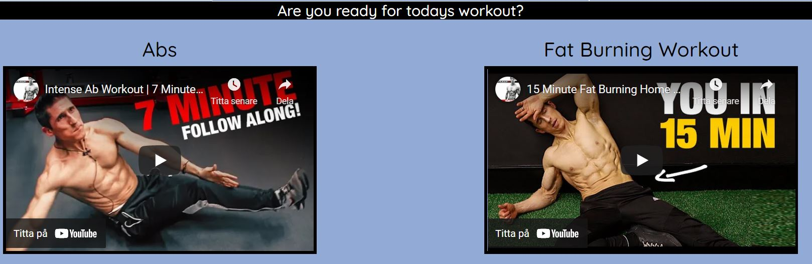

### Contact

* **Contact section**

    * At the top of the page there is a heading to reasure the user they are on the contact page.
    * Beneath the header to the left there is a container with contact information and a price tag for the membership in MyGym.
    * To the right of contact information there is a container with a question form if a user has any questions.
        * When on smaller devices these two container stacks on top of eachother.
    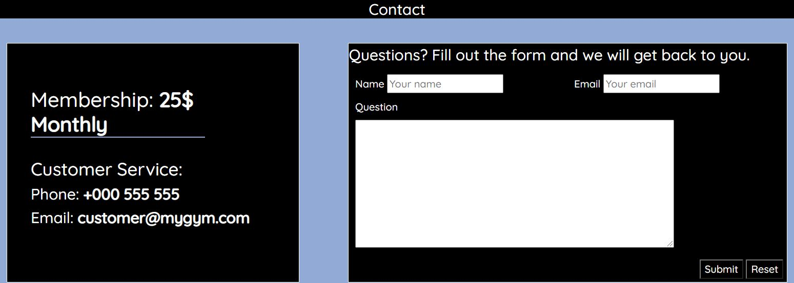

* **Location**

    * At the bottom of the page there is a map of the Gyms location and above it text containing the address.
    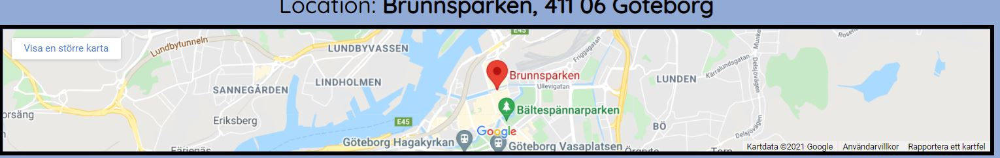

## Design choices

* Colors

    * I didn't want a white background so I tested a couple of colors and landed on a greyish blue. I chose that because it felt like it didn't take to much attention but still gave the background a little personality.

    * I gave the logo and the nav bar a black color, they were big and visual already. Then I also gave the reading material a black color to make it easy to read.

    * I gave the login button both in the top right corner and in the carousel a different styling to make it easy to spot. The top right corner has a black container and the text is white. The login button in the Carousel has a white container and black text.

    * In the Carousel I gave the text for the different images different colors to contrast the colors in the images.

    * The text I wanted to pop out a bit more I gave the color white.

    * To help the user to navigate easier I gave hover functions to the Logo, Nav bar, login button, all the anchor elements and the submit and reset button for the forms.

    * The colors I gave for the different workouts in the Schedule was picked to make them pop out of the other content. A slightly darker tone was picked so it would be a contrast.

* Fonts

    * I early on picked the font **Quicksand** and I stuck with that font throughout the project because I liked it. For the backup I picked **Sans-serif**.

## Design

* Most of my design choices came pretty early on the developement, I tested quite bit in Balsamiq and got a core design with four pages. Two of my design choices in the beginning was a big hero image with a lot of information and a login page, so my Mentor suggested me to make a carousel for the hero image and a modal for the login which I thought sounded challenging but a very good idea. 
Some of my choices came in the end of my project when I started experimenting because I didn't like some things and that led to me changing more.
One of those things was the Logo, Nav bar and login button. I had a more split version for a long period where the elements were far away from eachother and didn't really go together. So I started experimenting and got a better result. 
I struggled for a time with the contrast of the colors as well, but after some trial and error I managed to put my vision together.

### Features left to implement

* **Personal trainers**

    * A section with information about all of the personal trainers.

* **Group training**

    * A section with information about every single group workout offered at the gym and a layout of how every session could look like.

## Wireframes

* **Below you can see the links to the respective wireframes**

    * Full size, Desktop [Wireframe](https://github.com/Charlie9009/CI_MS1_MYGYM/blob/master/docs/wireframes/mygym_fullsize_desktop.pdf)
    * Tablet [Wireframe](https://github.com/Charlie9009/CI_MS1_MYGYM/blob/master/docs/wireframes/mygym_tablet.pdf)
    * Mobile [Wireframe](https://github.com/Charlie9009/CI_MS1_MYGYM/blob/master/docs/wireframes/mygym_mobile.pdf)

## Testing 

## User goals

* As a user I want to be able to manouver the site with ease.

* As a user I want to find out what the membership costs.

* As a user I need to be able to find the schedule for the group workouts, book sessions and see when they are.

* As a user I want to have a Gym were I can workout and also find videos online.

* As a user I want to find a workout video fast when I am ready to workout.

* As a user I want to be able to easily find contact info and location of the gym when navigating the site.

* As a user I want to find a personal trainer and a gym who can help me with my form.

* As a user I want to find out more about Athlean X.

* As a user I want to have access to MyGyms social media.

## Testing of user goals

* *As a user I want to be able to manouver the site with ease.*  
As soon as you land on the homepage there is an easily readible and clean navigation bar which is present throughout every page to have a consistency for the user. When on smaller devices a hamburger menu is used to keep it clean and consistent.

 
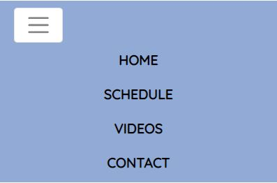

* *As a user I want to find out what the membership costs.*  
When you land on the homepage you will see the big carousel with 3 images rotating. When you scroll down you will read the text of the first image which presents the cost for the membership. The cost is also present on the contact page.  
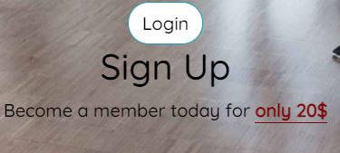

* *As a user I need to be able to find the schedule for the group workouts, book sessions and see when they are.*  
When I land on the homepage I will see the nav bar, I will see the text for schedule and click the link which will take me to the schedule site. Here I will scroll down and find the form for booking and the schedule with all the workouts.  
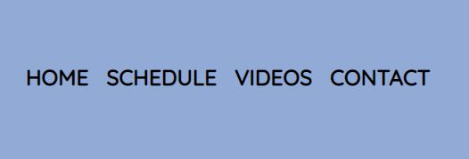
 

* *As a user I want to have a Gym were I can workout and also find videos online.* 
* *As a user I want to find a workout video fast when I am ready to workout.*  
When I land on the homepage I will see the nav bar, I will see the text for videos and click the link which will take me to the videos site.  

 

* *As a user I want to find a personal trainer and a gym who can help me with my form.*  
When I land on the homepage the carousel will start rotating and the text in the second image will tell me to go to *contact*(which is a clickable link) and call customer service if I want to talk to a personal trainer.  
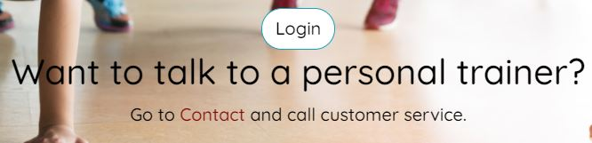
 
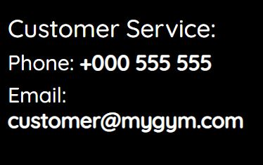

* *As a user I want to be able to easily find contact info and location of the gym when navigating the site.*  
If I want to find contact info I will have the nav bar at the top and the footer at the bottom which both are present on every page. There is a clickable link in both elements. When I click the *contact* link I get to the contact page where I can find contact info, question form, the monthly cost for the membership and a map and address to the gyms location.

 
 

 
 

 
 

* *As a user I want to find out more about Athlean X.*  
When I land on the homepage the carousel starts to rotate and the third image is of the *Athlean X* site. The text provides me with a link to the site and tells me to join up. If I scroll down I get to a section where I can find another link to Athlean X. There is also a link in the footer if I would ever feel lost on the page.  

 
 

 
 

 

* *As a user I want to have access to MyGyms social media.*  
When I land on the homepage I have the footer visible on the bottom of the page with links to social media like Facebook, Instagram and Youtube.  

### Validator testing

* **HTML**

    * No errors were found on index.html when passing through WC3 Validator, [index.html](https://github.com/Charlie9009/CI_MS1_MYGYM/blob/master/docs/validation/html_index_validator.JPG)

    * No errors were found on schedule.html when passing through WC3 Validator, [schedule.html](https://github.com/Charlie9009/CI_MS1_MYGYM/blob/master/docs/validation/html_schedule_validator.JPG)

    * No errors were found on videos.html when passing through WC3 Validator, [videos.html](https://github.com/Charlie9009/CI_MS1_MYGYM/blob/master/docs/validation/html_videos_validator.JPG)

    * No errors were found on contact.html when passing through WC3 Validator, [contact.html](https://github.com/Charlie9009/CI_MS1_MYGYM/blob/master/docs/validation/html_contact_validator.JPG)

* **CSS**

    * No errors were found on the CSS file when passing through Jigsaw W3 Validator, [CSS](https://github.com/Charlie9009/CI_MS1_MYGYM/blob/master/docs/validation/css_validator.JPG)

* **Wave**

    * No errors were found on the index.html when passing through Wave Validator, [index.html](https://github.com/Charlie9009/CI_MS1_MYGYM/blob/master/docs/validation/wave_index_validator.JPG)

    * No errors were found on the schedule.html when passing through Wave Validator, [schedule.html](https://github.com/Charlie9009/CI_MS1_MYGYM/blob/master/docs/validation/wave_schedule_validator.JPG)

    * No errors were found on the videos.html when passing through Wave Validator, [videos.html](https://github.com/Charlie9009/CI_MS1_MYGYM/blob/master/docs/validation/wave_videos_validator.JPG)

    * No errors were found on the contact.html when passing through Wave Validator, [contact.html](https://github.com/Charlie9009/CI_MS1_MYGYM/blob/master/docs/validation/wave_contact_validator.JPG)

## Further testing

* The website has been inspected thru the device toolbar in chrome.

* I have tested the website thru phones like One Plus 8T and Iphone XR.

* Friends and family has been asked to review the site.

## Known bugs

* Login in, and signing up does not work. This is something that will be developed later.

* Submitting the Schedule Form or the Question Form does not work. This will also be developed later.

## Squashed bugs

* For a while I had problems with the bootstrap and Javascript overriding my own CSS rules. I fixed it by placing my CSS stylesheet beneath the other links to have more priority.

* The code for the carousel had an extra incomplete div tag which I removed.

* I used Iframes for the videos in this project and I had paragraphs within those Iframes "*Sorry, your browser does not support Iframes*". But text within the Iframes did not go thru the validator so I removed them.

## Deployment

* The site was deployed to github pages.

    1. In your repository find the settings button and click it.
    2. Scroll down to GitHub Pages, beneath it says "Pages settings now has its own dedicated tab! Check it out here!" Click on "Check it out here".
    3. Find source and from the drop-down menu select master from branch, click save, let it update.
        * Here is a live link to the page https://charlie9009.github.io/CI_MS1_MYGYM/

## Responsive on all devices

## Languages Used

* HTML5

* CSS3

## Libraries and different programs used

* To get the "Modal Log in pop up window" to work, Bootstrap 4.1.3, jQuery and Popper JS was used.

* Font Awesome icons where used for social media in the footer.

* The Gitpod terminal was used to commit and push to Github.

* Github is used to store the code.

* Balsamiq was used to create the projects wireframes.

* WC3 Validator, Jigsaw W3 Validator, Wave Validator, Lighthouse and ami.responsivedesign were all used to test the website.

## Code Credit

* Code from Social Media Column Footer, with Font Awesome icons was copyed and restyled from Code Institutes "Love Running" project. (https://charlie9009.github.io/love-running/)

* Code for the Modal Login button and the pop up window was used from [codehim](https://www.codehim.com/bootstrap/bootstrap-4-modal-popup-login-form/). Styling was added to a degree for the login button only.

* Code for the Carousel was used from [getbootstrap](https://getbootstrap.com/docs/4.0/components/carousel/). The Carousel used was the one with indicators and then added captions. It was restyled to a degree in CSS.

* Code for the Schedule was used from [bootdey](https://www.bootdey.com/snippets/view/time-table#html). It was restyled in CSS.

* All the code besides the code mentioned above was written by me.

## Media Credit

### Images were googled and added to the project. Image sources were the following.

* https://wyckoffymca.org/fitness/small-group-training/

* https://www.polar.com/blog/what-is-group-fitness-benefits/

* https://freemotionfitness.com/fusion-team-training/

* https://athleanx.com/

## Acknowledgement

* My Mentor Mo has been invaluable, he pushed me to challenge myself and he was able to provide consistent and helpful feedback throughout my project.

* A friend of mine in the business Will, has been able to provide me with help and tips.
